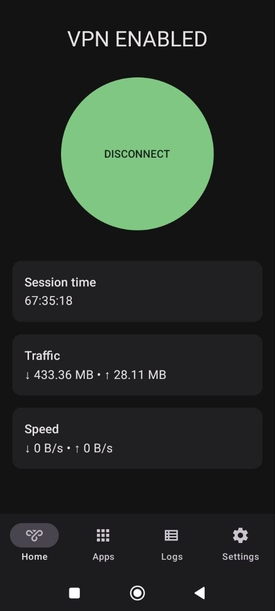
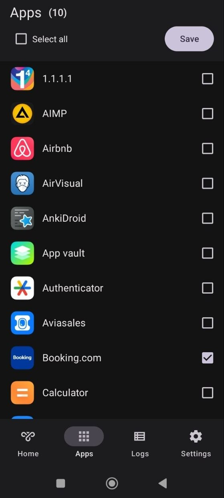
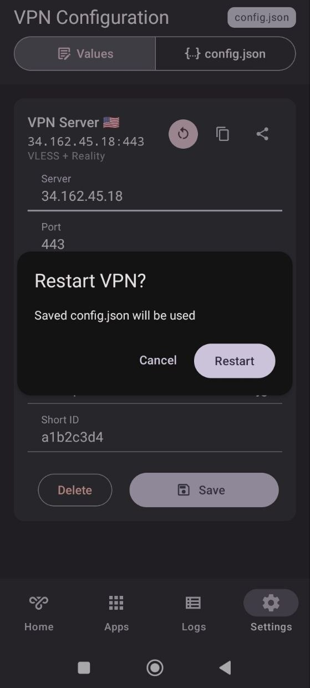

# My Mom's VPN

A simple Android VPN client you can explain to your mom. Supports VLESS/Reality.

---

## ✨ Features

* VLESS support
* Reality support
* Use your own configuration (no account required)
* Simple and clean UI
* Open-source

---

## 📱 Screenshots

<p>
  
  
    
</p>

---

## 🚀 Getting Started


### 1. Clone the repository

```
git clone https://github.com/pitbred/my-moms-vpn.git
```

### 2. Add required dependency

```
npm install
```

This project depends on `libbox.aar`, which is **not included** in the repository.

`libbox.aar` is a prebuilt Android library from the **sing-box** project.
It contains the core VPN functionality (VLESS / Reality, networking stack, etc.) used by this app.

Tested with:

* sing-box commit: fcc6017418fabc74af34c6f49b8ba2c9d55894a1
* or version: v1.14.0-alpha.5 (if applicable)

⚠️ Using a different version may introduce breaking changes and cause build errors.

#### 📦 How to add

You need to obtain `libbox.aar` yourself and place it in:

```
android/app/libs/libbox.aar
```

#### ⚙️ Gradle setup

Make sure your Gradle configuration includes local `.aar` files from the `libs` directory:

```gradle
repositories {
    flatDir {
        dirs 'libs'
    }
}

dependencies {
    implementation(name: 'libbox', ext: 'aar')
}
```

#### ⚠️ Notes

* The library is not included due to licensing and size considerations
* Make sure you are using a compatible version of `libbox`
* If the file is missing, the project will fail to build

### 3. Run the app (development)

To run the app on a connected Android device:

```bash
npx expo run:android --variant debug --device
```

This will:

* build a debug version of the app
* install it on your device
* start the development environment

### 4. Build APK (release)

To build a release APK:

```bash
cd android
./gradlew assembleRelease -PreactNativeArchitectures=arm64-v8a
```

The APK will be generated at:

```
android/app/build/outputs/apk/release/app-release.apk
```

### ⚠️ Notes

* Make sure you have configured **release signing** before building
* The release build uses `arm64-v8a` architecture
* If signing is not configured, the build may fallback to debug or fail

---

## ⚙️ Usage

1. Open the app
2. Paste your VLESS configuration
3. Tap "Connect"

That's it.

---

## 🔐 Privacy

* No user data is collected
* No analytics
* No tracking
* All configurations stay on your device

---

## ❤️ Support Development

If you find this project useful:

* ⭐ Give this repo a star — it really helps
* GitHub Sponsors (coming soon)
* Crypto (coming soon)

---

## ⚠️ Disclaimer

This project is provided for educational and personal use.

You are responsible for how you use this software and for complying with your local laws and regulations.

---

## 📄 License

MIT License
